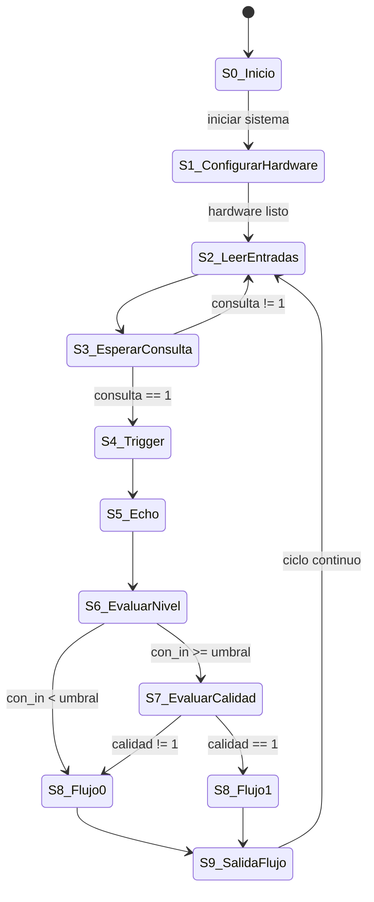
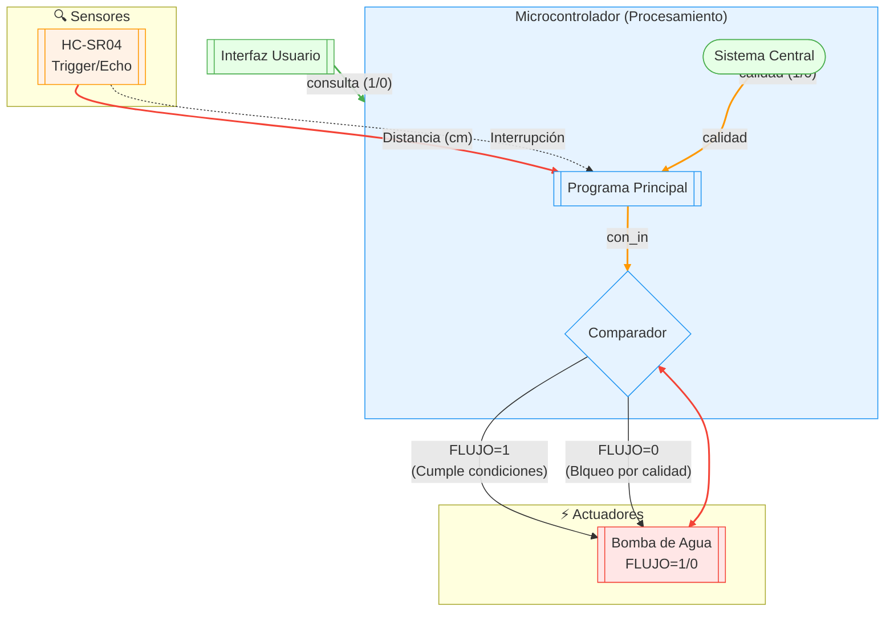

# Proyecto-Digital
**Sensor de medida del agua**

En el presente repositorio se expondrá en que conssitió el proyecto realizado en la aignatura de electrónica digital, mostrando el paso a paso realizado

- Juan David Gomez 
- David Leonardo Botia
- Yuliana
  
Bienvenidos a nuestro repositorio del proyecto final de nuestra clase de electrónica digital de la Universidad Nacional de Colombia del semestre 2025-I, el cual consistía en el diseño y posterior implementación de un Sensor para la medicion de agua, realizando una versión digital de este mismo mediante el uso de sensores ultrasónicos, FPGA y ESP32.
##
Objetivo general 

- Diseñar e implementar un sistema de medición de nivel de agua en tiempo real, utilizando un sensor ultrasónico HC-SR04, un microcontrolador ESP32 para la adquisición y transmisión de datos, y una FPGA para el procesamiento y control de señales digitales, con el fin de generar un prototipo funcional y escalable para aplicaciones de monitoreo

##
Objetivos especificos

- Diseñar el sistema de adquisición de datos del nivel de agua mediante el sensor ultrasónico HC-SR04, acoplado al ESP32 para capturar la distancia entre el sensor y la superficie del agua.
- Implementar el procesamiento digital de señales en la FPGA para gestionar el control del pulso de disparo (trigger) y la lectura precisa del pulso de eco del sensor HC-SR04.
- Integrar una interfaz de usuario o un canal de salida ( WI-FI usando el ESP32) para mostrar el nivel de agua en una aplicación o dashboard.
- Verificar y validar el sistema completo mediante simulaciones y pruebas físicas del prototipo en diferentes niveles de agua para asegurar la precisión y confiabilidad del sistema.
- Documentar todo el proceso de desarrollo, incluyendo requerimientos funcionales, diagramas ASM, códigos HDL y de microcontrolador, bitácoras de pruebas, y resultados experimentales.

##

El monitoreo del nivel de agua es esencial para la automatización. Este proyecto busca integrar tecnologías digitales con procesamiento distribuido para ofrecer una solución educativa y funcional para este tipo de monitoreo.

La arquitectura implementa una solución SoC híbrida, donde la **FPGA realiza la temporización de señales críticas**, y el **ESP32 actúa como nodo de comunicación inteligente**, gestionando el envío de datos por red.
##
**REQUERMIENTOS DEL PROYECTO**
##
**✅ Requerimientos Funcionales**

**🧭 Medición de distancia usando el sensor ultrasónico**
   - El sensor ultrasónico HC-SR04 mide la distancia al nivel de agua mediante pulsos de eco.
     
**⚙️Procesamiento digital de la señal de tiempo de retorno en una FPGA.**
   - La FPGA calcula el tiempo del eco y convierte el dato en una señal digital interpretable.
     
**💧 Cálculo del nivel de agua y generación de alerta si es bajo o alto.**
   - Se transforma la distancia en una medida de nivel y se compara con umbrales definidos.
     
**📡 Transmisión de datos desde la FPGA al ESP32 mediante UART.**
   - La FPGA envía el dato procesado al ESP32 mediante comunicación serial.
     
**🌐 Comunicación del dato medido a un servidor o aplicación.**
   - El ESP32 transmite el nivel de agua a una aplicación via WI-FI (ESP32)
     
**🧪 Sistema implementado**
   - Se revisa el hardware y se verifica  mediante simulación.

##
**✅ Requerimientos No Funcionales**

**⏱️ Tiempo de respuesta adecuado**
- El sistema debe responder a los cambios en el nivel de agua..

**🔁 Confiabilidad operativa**
- El sistema debe funcionar de manera continua y precisa sin fallas durante largos periodos.

**📈 Simulación funcional**
- Compatible con simuladores como Icarus Verilog + GTKWave.
  
**📝 Código documentado**
- Cada módulo está comentado para facilitar su comprensión y mantenimiento.
##
***Módulos Verilog**
| Archivo               | Función                                                                 |
|-----------------------|-------------------------------------------------------------------------|
| `SOC.v`               | Módulo principal del SoC, conecta CPU, memoria y periféricos.           |
| `top_tb.v`            | Testbenches para simular comportamiento.                                |
| `address_decoder.v`   | Decodifica direcciones para acceso a memoria y periféricos.             |
| `bench_quark.v`       | Banco de pruebas para la CPU (núcleo tipo Quark).                       |
| `chip_select.v`       | Controla la habilitación de módulos según la dirección.                 |  
| `uart_tx.v`           | Envía datos de estado por UART a microcontrolador o dispositivo.        | 
| `mult.v`              | Módulo principal del multiplicador.                                     |
| `hc_sr04.v`           | Controlador del sensor ultrasónico HC-SR04 para medición de distancia.  |

##
##
Diagrama ASM/ Maquina de estados/ diagramas funcionales:

**Diagrama general**

**Diagrama del sensor**

**Maquinas de Estado**

**MAPAS DIAGRAMA GENERAL**

# Máquina de Estados Finita (FSM) del Sistema de Control de Flujo

Este diagrama representa el flujo de control del sistema de medición de nivel de agua y activación de bomba, basado en el sensor ultrasónico HC-SR04 y una señal de calidad externa.

---

### Estados:

- **S0_Inicio**: Estado inicial del sistema.
- **S1_ConfigurarHardware**: Configuración del hardware.
- **S2_LeerEntradas**: Recolección de datos de entrada.
- **S3_EsperarConsulta**: Espera de señal desde el sistema central.
- **S4_Trigger**: Enviar pulso de disparo al sensor HC-SR04.
- **S5_Echo**: Lectura de tiempo de respuesta del sensor.
- **S6_EvaluarNivel**: Comparación entre "con_in" y "umbral".
- **S7_EvaluarCalidad**: Verifica si la calidad del agua es aceptable.
- **S8_Flujo0**: Desactivar bomba (flujo = 0).
- **S8_Flujo1**: Activar bomba (flujo = 1).
- **S9_SalidaFlujo**: Salida de control de flujo.

---

Este FSM se implementa a una ESP32 y forma parte de sistemas automatizados de control de nivel de agua.

# ⚙️ Diagrama Funcional del Sistema de Control de Agua

##
**Estados**

- Espera de Consulta: El sistema permanece en espera de una señal de consulta (desde el usuario o el sistema central).
- Medición de Distancia: Se activa el sensor HC-SR04 para medir la distancia al nivel del agua.
- Procesamiento de Datos: El microcontrolador recibe la distancia y evalúa la señal de calidad del agua.
- Comparación de Condiciones: Se compara si la distancia medida y la calidad cumplen los requisitos.
- Decisión de Flujo:
   FLUJO = 1: Se activa la bomba de agua.
  FLUJO = 0: Se bloquea el sistema por incumplimiento de condiciones.

**MAPAS DEL CONTROL DEL AGUA**

# Máquina de Estados Finita (FSM) del Sistema de Control de Flujo

Este diagrama representa el flujo de control del sistema de medición de nivel de agua y activación de bomba, basado en el sensor ultrasónico HC-SR04 y una señal de calidad externa.

---

### Estados:

- **S0_Inicio**: Estado inicial del sistema.
- **S1_ConfigurarHardware**: Configuración del hardware.
- **S2_LeerEntradas**: Recolección de datos de entrada.
- **S3_EsperarConsulta**: Espera de señal desde el sistema central.
- **S4_Trigger**: Enviar pulso de disparo al sensor HC-SR04.
- **S5_Echo**: Lectura de tiempo de respuesta del sensor.
- **S6_EvaluarNivel**: Comparación entre "con_in" y "umbral".
- **S7_EvaluarCalidad**: Verifica si la calidad del agua es aceptable.
- **S8_Flujo0**: Desactivar bomba (flujo = 0).
- **S8_Flujo1**: Activar bomba (flujo = 1).
- **S9_SalidaFlujo**: Salida de control de flujo.

---

Este FSM se implementa en el  microcontrolador  ESP32 y forma parte de sistemas automatizados de control de nivel de agua.

# Diagrama Funcional del Sistema de Control de Nivel de Agua

---
##
### Estados:

- **GenerarTrigger**: Envía el pulso ultrasónico desde el sensor HC-SR04.
- **EsperaEcho**: Monitorea la señal de Echo del HC-SR04.
- **CapturaEcho**: Mide el tiempo del pulso de retorno.
- **CalcularDistancia**: Calcula la distancia usando el tiempo medido.
- **Resultado**: Guarda o muestra la distancia medida.
- **Error**: Indica una falla por falta de respuesta (Timeout).
- **TriggerON**: Pone Trigger = 1, activando el pulso ultrasónico.
- **ConteoON**: Cuenta ciclos para controlar la duración del Trigger.
- **TriggerOFF**: Pone Trigger = 0, finalizando el pulso.
- **Escucha**: Espera un flanco de subida en Echo para comenzar la medición.
- **Timeout**: Indica que no se recibió Echo a tiempo; salta a error.
- **MedirTiempo**: Mide cuánto tiempo permanece Echo en alto.
- **FinCaptura**: Detecta flanco de bajada en Echo; finaliza el conteo.
- **CalcularDistancia**: Aplica la fórmula de distancia:
     distancia = (con_in × 34300) / (2 × 25e6)

##
Simulación con testbenches
Simulación en verilog-gtkwave (make sim),  o vídeo de simulación en digital (únicamente youtube, no se acepta drive o similares)
##
Diagrama RTL del SoC y su mòdulo:
Diagrama RTL del SoC y de su módulo (make rtl, make rtl top=modulo_especifico)
##

**RTL DEL SOC**

Este muestra toda la estructura del sistema embebido (SoC): incluye el procesador, los periféricos, los buses de comunicación, la memoria y los módulos personalizados como el del sensor HC-SR04

**Procesador FemtoRV32**
- El núcleo principal del sistema es el FemtoRV32, encargado de ejecutar instrucciones almacenadas en memoria. Se comunica con los periféricos a través de direcciones de memoria usando el esquema de memoria mapeada (MMIO). Todas las operaciones de lectura y escritura se realizan a través de las señales estándar del bus (mem_addr, mem_rstrb, mem_wdata, etc.).

**Decodificador de Direcciones y Memoria**

- El bus de direcciones se divide para seleccionar entre diferentes módulos:
- Una memoria principal, donde se almacenan instrucciones y datos.
- Un bloque chip_select, que habilita el periférico correspondiente según la dirección.
- Este decodificador activa una de las líneas chipX_dout, que permiten direccionar correctamente la lectura desde los distintos módulos.

**Periférico UART**

- El módulo UART proporciona comunicación serial entre la FPGA y un dispositivo externo (como una ESP32 o PC). El procesador puede enviar y recibir datos por medio de este periférico, y también se incluye una salida ledout que se puede utilizar como indicador visual de actividad.

**Periférico HC-SR04 (Sensor ultrasónico)**

- Este módulo controla un sensor ultrasónico para medir distancia. Recibe la señal ECHO del sensor y genera un pulso de TRIGGER. El resultado de la medición se almacena internamente y se puede leer desde el procesador. Adicionalmente, si la distancia medida es inferior a cierto umbral, se activa la señal ACTIVAR, que puede utilizarse para encender una bomba u otro actuador.

**Periférico Multiplicador**

- Este módulo realiza operaciones de multiplicación entre datos escritos por el procesador. El resultado se puede leer posteriormente, útil para pruebas o cálculos intermedios en el sistema.

**LEDs**

- Los LED conectados al sistema actúan como indicadores de estado. En este diseño, están conectados a la salida del módulo UART (ledout) para visualizar actividad de comunicación o estados definidos por el firmware.

**Flujo de operación general**

- El procesador accede a una dirección específica.
- El decodificador de direcciones (chip_select) determina si se trata de memoria o un periférico.
- Si es un periférico, se habilitan señales de control (rd, wr, cs).
- El periférico responde con datos en d_out, que se enrutan hacia mem_rdata para que el procesador los lea.

**RLT DEL SENSOR**

Este muestra sólo la lógica del módulo HC-SR04: cómo se manejan las señales echo, trigger, distance, los contadores, registros y comparadores internos.

**Generador del pulso trigger**

- A partir del reloj (clk) y un contador, se genera un pulso de duración fija.
- Este pulso se envía al sensor por la señal trigger.
- El trigger se activa al comienzo de la medición y se desactiva automáticamente tras unos ciclos.

**Captura del echo**

- Cuando el sensor recibe el pulso de trigger, responde con una señal echo cuyo ancho representa el tiempo de ida y vuelta de la onda ultrasónica.
- El sistema detecta el flanco de subida del echo para comenzar a contar.
- Detecta el flanco de bajada para detener el contador.
-  El valor del contador en este intervalo representa el tiempo de vuelo del sonido (proporcional a la distancia).

**Registro y cálculo de la distancia**

- El valor medido se guarda en un registro.
- Un par de multiplexores permiten seleccionar y cargar ese valor en la salida distance.
- El procesamiento adicional como escalamiento (dividir por una constante) puede implementarse en firmware.

**Comparador con el umbral**

- La señal umbral de 16 bits se compara con la distancia calculada.
- Si la distancia es menor que el umbral, se activa una señal lógica.
- Esta señal de comparación genera la salida activar, útil para encender una bomba o activar un actuador.

**Control interno (FSM implícita)**

- Multiplexores y selectores internos dirigen el flujo de datos en función del estado del sistema: reinicio, espera, medición, comparación.
- Varios bloques realizan selección de entradas y salidas según condiciones binarias (por ejemplo, selección entre 0x0 y 0x1).
- El sistema se reinicia con la señal rst y opera sincronizado con el reloj clk.

**RLT PERIP**

Muestra la lógica de integración del módulo sensor como un periférico mapeado a memoria, con señales de dirección, lectura/escritura, selección de chip, etc.

Este diagrama representa el sistema de control completo implementado en una FPGA, encargado de leer y escribir datos a través de una interfaz de bus y controlar una bomba de agua en función de la distancia medida por el sensor ultrasónico HC-SR04.

**Funcionalidad general**
- El sistema conecta el módulo periférico HC-SR04 a un bus de datos de 32 bits a través de una interfaz direccionable que permite:
- Escribir el umbral de activación.
- Leer la distancia medida por el sensor.
- Activar o desactivar la bomba según si la distancia es menor que el umbral.
- Esto lo convierte en un periférico direccionable y configurable dentro de un sistema embebido más grande.

**Interfaz de comunicación con el bus**

- Entradas: addr, wr, rd, cs, d_in
- Salidas: d_out
- Esta interfaz permite al microcontrolador o procesador central comunicarse con el periférico usando direcciones específicas.
Dirección 0x8: permite escribir el umbral para el sensor.
Dirección 0x5A00: permite leer la distancia medida por el sensor.
- Un comparador y lógica de control (wr, rd, cs, addr) habilitan la escritura o lectura según corresponda.

**Registro de umbral**

- El dato proveniente del bus (d_in[15:0]) se carga en el registro del umbral si se cumple la condición de escritura a la dirección 0x8.
- Este umbral se envía directamente al módulo hc_sr04 para ser usado como valor de comparación.

**Módulo hc_sr04**

- Entradas: clk, rst, echo, umbral
- Salidas: trigger, distance, activar
- Este bloque encapsula la lógica que mide la distancia y genera la señal de activación si la distancia es menor al umbral (ver explicación del diagrama anterior).

**Lectura del valor medido**

- Cuando se activa la señal de lectura (rd) con la dirección 0x5A00, el valor de distance se selecciona mediante multiplexores y se envía a d_out[15:0].
- Esto permite al procesador conocer el valor de distancia medido por el sensor.

**Activación de bomba**

- La señal activar del módulo hc_sr04 pasa por un multiplexor para convertirse en activar_bomba.
- Esta salida puede usarse para controlar directamente una bomba de agua (o cualquier otro actuador) según el resultado de la comparación.
  
  **Flujo de datos**
- El sistema recibe un valor de umbral desde el bus (por ejemplo, 100 cm).
- El módulo hc_sr04 mide la distancia y la compara con el umbral.
- Si la distancia es menor, se activa la señal activar_bomba.
- El sistema también puede leer el valor actual de distancia desde el bus.

##
Simulaciones:
Archivos fuentes del SoC, simulaciones, etc.

Medición de la distancia "sensor "

##
Video simulacion:
##
Logs de make log-prn, make log-syn diagramas de flujo 
Logs de make log-pnr, make log-syn, donde se identifique los warnings y los recursos usados en el flujo de síntesis.

**make log syn** 

##  Estadísticas del SoC sintetizado

| Recurso                | Cantidad |
|------------------------|----------|
| **Total de wires**     | 786      |
| Bits en wires          | 4270     |
| Wires públicos         | 786      |
| Bits en wires públicos | 4270     |
| Memorias               | 0        |
| Bits de memoria        | 0        |
| Procesos               | 0        |
| **Celdas utilizadas**  | 1928     |

**Number of wires** : 786

Se refiere a la cantidad total de señales lógicas (también llamadas "wires") que interconectan los distintos bloques o módulos del sistema. Estas señales permiten la transmisión de información entre las distintas partes del SoC.

**Number of wire bits** : 4270

Cada wire puede tener uno o más bits (por ejemplo, buses de datos de 16 o 32 bits). Esta cifra indica la cantidad total de bits individuales que componen todas las señales del sistema.

**Number of public wires** : 786

Corresponde al número de señales que están declaradas como públicas, es decir, accesibles desde el exterior del módulo principal. Generalmente, incluyen entradas, salidas o interfaces de comunicación.

**Number of public wire bits** : 4270

Representa la cantidad total de bits dentro de las señales públicas. Es útil para estimar cuánta información puede intercambiar el sistema con el exterior.

**Number of memories** : 0

Este valor indica que no se utilizaron bloques de memoria (como RAM o ROM internos) en el diseño. Todo el almacenamiento o procesamiento se realiza mediante registros o lógica combinacional.

**Number of memory bits** : 0

Al no haber bloques de memoria declarados, tampoco se utilizan bits de memoria para almacenamiento interno.

**Number of processe** : 0

Significa que el diseño no contiene bloques secuenciales de alto nivel (always, initial, etc.), por lo que se deduce que es una implementación completamente estructural, usando módulos y conexiones explícitas.

**Number of cells** : 1928

Indica la cantidad total de celdas lógicas utilizadas. Estas celdas son primitivas básicas de la FPGA (como flip-flops, LUTs, registros, etc.) que implementan el comportamiento funcional del sistema.

###  Tipos de celdas utilizadas

| Tipo de celda    | Cantidad |
|------------------|----------|
| `SB_CARRY`       | 266      |
| `SB_DFF`         | 35       |
| `SB_DFFE`        | 136      |
| `SB_DFFER`       | 85       |
| `SB_DFFESR`      | 126      |
| `SB_DFFESS`      | 1        |
| `SB_DFFR`        | 3        |
| `SB_DFFSR`       | 18       |
| `SB_DFFSS`       | 4        |
| `SB_LUT4`        | 1234     |
| `SB_RAM40_4K`    | 20       |

**SB_CARRY** : 266

Celdas dedicadas a operaciones aritméticas, especialmente a la propagación de acarreo en sumadores. Son fundamentales en operaciones como conteo, suma y comparación.

**SB_DFF** : 35

Flip-flops tipo D básicos, usados para almacenar bits individuales en circuitos secuenciales. Se activan en el flanco de reloj y almacenan el valor de entrada D.

**SB_DFFE** : 136

Flip-flops tipo D con habilitación (enable). Solo almacenan datos cuando la señal de habilitación está activa, permitiendo ahorrar recursos y evitar cambios innecesarios.

**SB_DFFER**: 85

Variante del flip-flop D con habilitación y señal de reinicio (reset). Permite inicializar o limpiar el contenido del flip-flop cuando se necesita.

**SB_DFFESR** : 126

Flip-flop más complejo que incluye habilitación, señal de set y reset. Ideal para controladores que requieren múltiples condiciones de control para establecer o reiniciar el estado.

**SB_DFFESS** : 1

Variante de flip-flop con señal de set y habilitación simultáneas. Muy específico para lógicas de control donde se debe forzar un 1 bajo condiciones controladas.

**SB_DFFR** : 3

Flip-flop tipo D con reset asíncrono. Este tipo permite reiniciar su valor independientemente del reloj, útil en situaciones donde se necesita una limpieza inmediata del sistema.

**SB_DFFSR** : 18

Flip-flops con set y reset asíncronos, que permiten forzar valores altos o bajos bajo condiciones específicas, sin depender del reloj del sistema.

**SB_DFFSS** : 4

Flip-flop con doble señal de set. Se emplean en sistemas con múltiples fuentes de activación forzada del estado alto (set).
##

**make log-pnr**

###  Utilización de Recursos del Dispositivo

| Recurso             | Uso        | Total Disponible | % Utilizado | Descripción                                                                 |
|---------------------|------------|------------------|-------------|-----------------------------------------------------------------------------|
| **ICESTORM_LC**     | 1389       | 7680             | 18%         | Celdas lógicas utilizadas para lógica combinacional y secuencial.          |
| **ICESTORM_RAM**    | 20         | 32               | 62%         | Bloques de memoria RAM interna usados para almacenamiento de datos.        |
| **SB_IO**           | 8          | 256              | 3%          | Pines de entrada/salida ocupados para comunicación con periféricos.        |
| **SB_GB**           | 7          | 8                | 87%         | Buffers globales usados para distribuir señales de reloj o control.        |
| **ICESTORM_PLL**    | 0          | 2                | 0%          | Módulos PLL usados para generación/modificación de relojes (no usados).    |
| **SB_WARMBOOT**     | 0          | 1                | 0%          | Módulo para reinicio en caliente (warmboot), no utilizado en este diseño.  |

**ICESTORM_LC** (Logic Cells)

Se utilizaron 1389 celdas lógicas de las 7680 disponibles (18%). Estas celdas contienen LUTs (tablas de verdad programables) y flip-flops, y son los bloques fundamentales que implementan la lógica combinacional y secuencial del sistema.

**ICESTORM_RAM**

- Se usaron 20 bloques de RAM interna de los 32 disponibles (62%). Estas memorias se utilizan para almacenar datos temporales o estructuras específicas que requieren acceso rápido por parte del SoC o periféricos.

**SB_IO** (Input/Output Pins)

- Se emplearon 8 pines de E/S de los 256 disponibles (3%). Estos pines permiten la comunicación con dispositivos externos, como sensores, microcontroladores o módulos UART.

**SB_GB** (Global Buffers)

- Se usaron 7 buffers globales de 8 posibles (87%). Estos buffers distribuyen señales críticas como relojes (clocks) y señales de control a través de todo el chip de forma eficiente y sincronizada.

**ICESTORM_PLL**

- No se utilizó ningún PLL (Phase-Locked Loop), de los 2 disponibles (0%). Los PLL son útiles para generar relojes con frecuencias distintas o fases ajustadas, pero en este diseño no fueron necesarios.

**SB_WARMBOOT**
- El módulo de reinicio en caliente (warmboot) no se utilizó (0/1). Este componente permite cambiar entre diferentes imágenes de configuración del FPGA sin necesidad de reiniciar físicamente el dispositivo, y puede ser útil para actualizaciones dinámicas del sistema.

##
¿Còmo interactùa con entornos externos?
Explicación sobre el cómo interactúa con aplicaciones externas (mqtt, chuck) etc.
##
Video del proyecto
Vídeo de youtube explicando el flujo de diseño (lo que se ve en el README.md) e implementación, agregar el enlace del vídeo del  README.md del módulo.
##
. En el README.md del proyecto explicar el contexto y la arquitectura.
##
